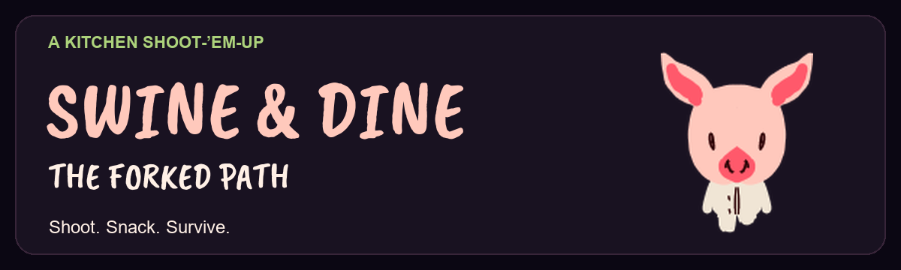
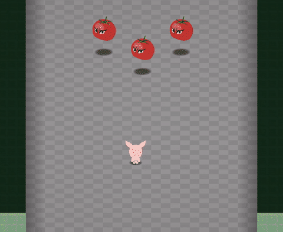
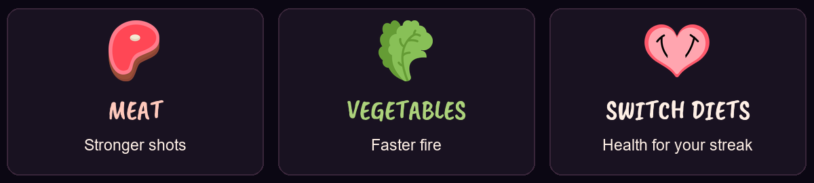
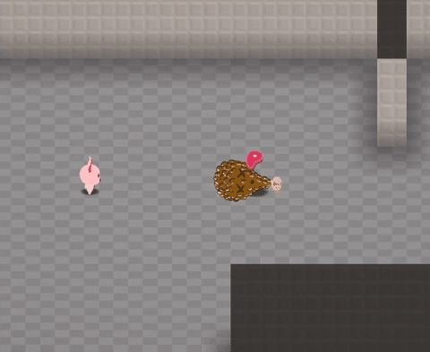

# Swine & Dine: The Forked Path

  

Fight hordes of food and grow stronger according to the diet you choose.

  

*Dinner fights back. Gameplay captured from the project's recordings.*

## About the game

A classic shoot-'em-up inspired by **Pocky & Rocky** and **Elfazar's Hat (UFO 50)**.

You play as a hungry swine raiding a kitchen, fighting through waves of food enemies on the way to a surprising boss encounter. Eat defeated enemies to build a meat or vegetable streak and change your weapon. Switching diets can restore health, but resets your streak.

The game is a Unity prototype with a browser release on [itch.io](https://ivanpavlov.itch.io/swine-dine-the-forked-path).

## How to play

[**Play in your browser on itch.io**](https://ivanpavlov.itch.io/swine-dine-the-forked-path). Choose keyboard or mobile input on the opening screen.

To run the source project, use **Unity 6000.3.25f1**, open `Assets/ForkedPath/Scenes/Input Select.unity`, and enter Play mode. See [Setup](docs/SETUP.md) for import instructions and the Editor's mobile UI override.

### Controls

Use the **switch button on the right edge of the screen** to cycle between three control schemes:

| Scheme | Movement and aiming |
| --- | --- |
| **8-Directional (Mono)** | Move in eight directions; your movement direction also sets your aim. You can lock that direction while firing. |
| **8-Directional (Bi)** | Move and aim independently, both in eight directions. A direction lock is available. |
| **Continuous (Bi)** | Move and aim independently with free directional aiming. The direction-lock toggle is hidden. |

#### Mobile

Use the on-screen controls. Mono mode provides a movement stick and a fire button. Bi modes provide separate movement and aiming sticks; moving the aiming stick fires automatically, and releasing it stops firing. Use the lock toggle in the eight-directional modes when you want to keep your firing direction while moving.

#### PC

| Input | Action |
| --- | --- |
| **WASD** or **arrow keys** | Move; also set your aim in Mono mode. |
| **Mouse pointer** | Aim in Bi modes. |
| **X** or **left mouse button** | Fire. |
| **E** | Toggle shooting-direction lock in the eight-directional modes. |
| **On-screen switch button** | Change control scheme. |
| **Stop moving and firing near edible food** | Eat automatically after a short pause. |

Eating takes about half a second within reach of a defeated edible enemy. Release the fire button or aiming stick while eating. Keep collecting the same food type for upgrades, and watch your ammunition: running out can lower your weapon level.

  

*Stop moving and firing beside defeated food to eat automatically.*

## Repository

The game's source and assets live under [Assets/ForkedPath](Assets/ForkedPath/). The repository directory may be called **ForkedPath**; the game's title is **Swine & Dine: The Forked Path**.

| Location | Contents |
| --- | --- |
| [Assets/ForkedPath](Assets/ForkedPath/) | Gameplay scripts, scenes, prefabs, configuration, art, and audio. |
| [Assets/CommonScripts](Assets/CommonScripts/) | Shared utilities, UI helpers, audio helpers, and build numbering. |
| [Packages](Packages/) and [ProjectSettings](ProjectSettings/) | Unity dependencies and project settings. |
| [docs](docs/) | Setup, architecture, and credits. |
| [media](media/) and [Promo](Promo/) | Documentation images and promotional material. |

The existing project license is **GNU GPLv3**, with the full text in [LICENSE](LICENSE). Bundled dependencies and third-party assets have separate terms; see the [license overview](LICENSE.md) and [credits](docs/CREDITS.md) for the current inventory and unresolved permissions.

## Contents

- [Setup](docs/SETUP.md) — open, build, and check the game.
- [Architecture](docs/ARCHITECTURE.md) — scenes, game flow, systems, and content authoring.
- [Credits](docs/CREDITS.md) — creators, tools, asset sources, and notices.
- [License](LICENSE.md) — project licensing and third-party scope.
