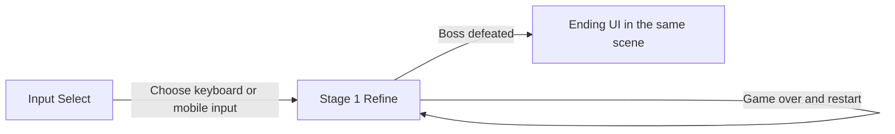

[Back to the landing page](../README.md)

# Architecture

This guide follows the scenes into the systems that run them. Behavior is split between scene managers, entity components, and ScriptableObject configuration. Inspector references are part of the implementation: a script alone often does not describe the complete setup.

## Scenes

The current release flow is:

The first two scenes are enabled in [EditorBuildSettings.asset](../ProjectSettings/EditorBuildSettings.asset). The ending is UI inside the gameplay scene, not another scene transition.

### Input Select

The *Input Select Scene* object has an [InputSelectScene](../Assets/ForkedPath/Scripts/Levels/InputSelectScene.cs) component. It preloads its configured `nextScene`, currently `Stage 1 Refine`, while holding activation until a choice is made.

The buttons set the static `MobileUIManager.mobileUIActive` flag, then activate the next scene. This selects whether virtual controls are visible; it does not select an aiming scheme. The Editor can override the flag; see [Setup](SETUP.md#mobile-ui-in-the-editor).

### Stage 1 Refine

[Stage 1 Refine](../Assets/ForkedPath/Scenes/Stage%201%20Refine.unity) contains the refined graphics and gameplay content: managers, player spawning, enemy encounters, cameras, tilemaps, and UI.

The other scenes under [Scenes](../Assets/ForkedPath/Scenes/) are outside the release build list: `Stage 1 Draft`, `Arena`, `Boss Foght test`, `Test Dolly`, and `init`. Treat them as alternate/draft/test setups and inspect their wiring before using them as gameplay entry points.

## Game Flow

The game is controlled mainly by three mechanisms:

1. **Stage progression** — opening, game over, restart, and ending.
2. **Events bus** — communication between entities and managers.
3. **Game systems** — player, entities, input, progression, and presentation.

### Stage progression

[Stage1](../Assets/ForkedPath/Scripts/Levels/Stage1.cs) controls the opening and game-over UI. It listens for `OnPlayerGameOver` to show the death group. The restart action calls [GameManager.RestartLevel](../Assets/ForkedPath/Scripts/Base%20Game/GameManager.cs), which fades the transition UI in and reloads the current scene.

For the ending, `Stage1` listens for an entity death whose config's `entityID` is `hamburger`, waits four seconds, and shows [EndingUI](../Assets/ForkedPath/Scripts/UI/EndingUI.cs). That ID connects the boss configuration to stage completion.

### Events bus

[GameEvents](../Assets/ForkedPath/Scripts/GameEvents/GameEvents.cs) exists in the scene as a singleton. It exposes C# `Action` fields rather than queued messages; invoking an action immediately calls its current subscribers.

There are two useful groups:

| Group | Examples | Purpose |
| --- | --- | --- |
| **World/entity events** | `OnDamage`, `OnDeath`, `OnEntitySpawned`, `OnEntityEaten`, `OnPlayerEnterTrigger`, `OnFX` | Connect health, entity states, encounters, cameras, and effects. |
| **Player/game events** | `OnPlayerRespawned`, `OnPlayerLivesChanged`, `OnPlayerGameOver`, `OnPlayerUpgraded`, `OnPlayerFoodConsumed` | Connect the active avatar, food progression, and game UI. |

Payload classes are under [GameEventsData](../Assets/ForkedPath/Scripts/GameEvents/GameEventsData/). Consumers generally subscribe in `OnEnable` and unsubscribe in `OnDisable`; follow that pattern when adding listeners.

### Game Systems

#### Player

The player consists of a [Player](../Assets/ForkedPath/Scripts/Player/Player.cs) manager and a currently spawned avatar with a [PlayerController](../Assets/ForkedPath/Scripts/Player/PlayerController.cs) component.

`Player` holds the active avatar, remaining respawns, spawn point, and base entity config. It converts damage/death events for that avatar into player events. On death it clears the avatar reference, spends a remaining respawn if available, and spawns a new avatar after a delay. With no respawns left, it emits game over.

`PlayerController` derives from [EntityComponent](../Assets/ForkedPath/Scripts/Entity%20Components/EntityComponent.cs), not `Entity`. It works alongside an `Entity`, handles movement/facing, and enables eating only while neither moving nor shooting. [PlayerShooterController](../Assets/ForkedPath/Scripts/Entity%20Components/Static/Player/PlayerShooterController.cs) connects facing and fire state to `AutomaticShooter`.

#### Entities

[EntityConfig](../Assets/ForkedPath/Scripts/Entity%20Base/EntityConfig.cs) is a spawning recipe: prefab, ID, food type, health, movement/contact settings, and effects data. [EntitiesSpawnManager](../Assets/ForkedPath/Scripts/Spawn/EntitiesSpawnManager.cs) instantiates the prefab, initializes its `Entity`, and emits `OnEntitySpawned`.

[Entity](../Assets/ForkedPath/Scripts/Entity%20Base/Entity.cs) owns the config and state. [Health](../Assets/ForkedPath/Scripts/Entity%20Base/Health.cs) handles damage, death, invincibility, and falling. Other components react to `Entity.StateChanged` through `EntityComponent`. [EntityState](../Assets/ForkedPath/Scripts/Entity%20Base/EntityState.cs) includes alive, hit, invincible, falling, dead, dead-falling, and despawned states.

Configs use C# inheritance for specialized types, plus an explicit fallback chain for audio/VFX entries. [BaseConfig](../Assets/ForkedPath/Scripts/Base%20Config/BaseConfig.cs) supplies local/general fallback references. [FXResolver](../Assets/ForkedPath/Scripts/Base%20FX/FXResolver.cs) checks the requested context on the source config, then local fallback, then general fallback when enabled. This does not automatically inherit all gameplay fields. Keep fallback references acyclic.

A typical combat-to-food sequence is:

1. `Health` applies damage and emits `OnDamage`, then `OnDeath` when appropriate.
2. `Entity` changes state. Components stop living behavior; edible dead entities can remain as food.
3. [AutomaticEater](../Assets/ForkedPath/Scripts/Entity%20Components/Actions/AutomaticEater.cs) tracks nearby edible entities. With eating enabled, it waits about **0.5 seconds** and calls `prey.Eat(eater)`.
4. Eating sets the prey to `Despawned` and emits `OnEntityEaten`.
5. Progression updates for the active player, while [CorpseManager](../Assets/ForkedPath/Scripts/Corpse/CorpseManager.cs) destroys the consumed object after a short delay.

`NotEdible` entities cannot be eaten. Falling and invincibility have separate events/transitions; read them alongside death and hit-stun when changing this flow.

#### Input

The gameplay scene's *Input* GameObject holds Unity's `PlayerInput`, [PlayerInputController](../Assets/ForkedPath/Scripts/Entity%20Components/Static/Player/PlayerInputController.cs), and [DebugInputController](../Assets/ForkedPath/Scripts/Debug/DebugInputController.cs).

`PlayerInput` references [ForkedPath_Actions](../Assets/ForkedPath/Resources/Input/ForkedPath_Actions.inputactions), starts on the `Player` map, and uses **Send Messages**. Action names must match callbacks such as `OnMove`, `OnAttack`, and `OnMouseAim`. `PlayerInputController` holds movement, aim, firing, and lock state. Virtual sticks/buttons feed the same controller through `MobileUIManager`.

[InputSchemeManager](../Assets/ForkedPath/Scripts/Input/InputSchemeManager.cs) cycles the three schemes stored in `GameConfig.InputScheme`:

| Enum | UI label | Behavior |
| --- | --- | --- |
| `Old8Directional` | `8-Directional (Mono)` | Movement and aim snap to eight directions. Movement sets facing; lock preserves facing while shooting. |
| `New8Directional` | `8-Directional (Bi)` | Movement and separate aim snap to eight directions. Aim takes precedence; lock holds the firing direction after shooting starts. |
| `Continuous` | `Continious (Bi)` in the current asset | Continuous movement/aim with eight-directional animation facing. The lock toggle is hidden and the facing handler does not apply it. |

The virtual aiming sticks set firing automatically in Bi schemes. Mouse aiming updates the aim vector; PC firing still comes from X or left mouse. Template bindings such as Jump/Crouch/Sprint and controller/XR bindings do not establish implemented gameplay features. In particular, the asset's `Look` action does not match the controller's `OnAim` callback under Send Messages.

The Debug map is enabled only in the Editor: **Ctrl+R** reloads and **F1** toggles the entity-state overlay.

#### Game Data

[G](../Assets/ForkedPath/Scripts/Base%20Game/G.cs) is a scene singleton holding references to `PlayerInput`, the boss fight controller, and stage-start/death UI groups. It is a reference holder, not a save system.

[GameBootstrapper](../Assets/ForkedPath/Scripts/Base%20Game/GameBootstrapper.cs) loads [GameConfig](../Assets/ForkedPath/Scripts/Base%20Game/GameConfig.cs). [SingletonScriptableObject](../Assets/CommonScripts/SingletonScriptableObject.cs) searches Resources for that type; it throws if none exists and warns/uses the first if multiple exist. Keep one `GameConfig` asset in Resources.

The current [Game Config.asset](../Assets/ForkedPath/Resources/Scriptable%20Objects/Game/Game%20Config.asset) holds entity/projectile fallback configs and the input scheme. Other managers receive config assets through Inspector references.

Food progression has four main parts:

| Part | Responsibility |
| --- | --- |
| [FoodComboTracker](../Assets/ForkedPath/Scripts/Progression/FoodComboTracker.cs) | Food type, unspent count, and level; spends thresholds on upgrades. Mixing food resets the streak and heals when unspent food remains. |
| [FoodRulesConfig](../Assets/ForkedPath/Scripts/Progression/FoodRulesConfig.cs) | Per-food upgrade thresholds. |
| [ProgressionConfig](../Assets/ForkedPath/Scripts/Progression/ProgressionConfig.cs) | Base state and weapon/ammo data for each food branch and level. |
| [ProgressionManager](../Assets/ForkedPath/Scripts/Progression/ProgressionManager.cs) | Consumes eating/respawn/death events, applies upgrades, replaces weapon patterns, tracks ammo, and emits UI events. |

Respawning creates a new tracker and restores the base weapon. A player's corpse can retain a recoverable fraction of collected food through `FoodHolder`. Capped ammo is consumed on shooter events; running out degrades progression. Stored food can immediately satisfy another upgrade, so the result depends on both current level and unspent count.

[AutomaticShooter](../Assets/ForkedPath/Scripts/Entity%20Components/Actions/AutomaticShooter.cs) executes [ProjectilesPattern](../Assets/ForkedPath/Scripts/Projectiles/ProjectilesPattern.cs) waves: delays, count, spread, offsets, and randomization. Waves reference [ProjectileConfig](../Assets/ForkedPath/Scripts/Projectiles/ProjectileConfig.cs) assets; [ProjectileManager](../Assets/ForkedPath/Scripts/Projectiles/ProjectileManager.cs) creates the projectiles.

#### UI

[MobileUI](../Assets/ForkedPath/Scripts/Mobile/UI/MobileUI.cs) has a layout for each scheme. [MobileUIManager](../Assets/ForkedPath/Scripts/Mobile/UI/MobileUIManager.cs) connects those controls to the input controller and updates the layout when the scheme changes.

[ChangeInputUI](../Assets/ForkedPath/Scripts/UI/ChangeInputUI.cs) cycles schemes, displays names, and shows/hides the lock toggle. Its current display data is in the [Canvas Group prefab](../Assets/ForkedPath/Resources/Prefabs/UI/Canvas%20Group.prefab).

`UILives`, progression UI, and `UpgradesNotificationUI` display player state. [TransitionUI](../Assets/ForkedPath/Scripts/UI/TransitionUI.cs) handles fades and `EndingUI` presents the ending. Scripts are under [UI](../Assets/ForkedPath/Scripts/UI/).

## Level content

### Enemy spawns and encounters

[PlayerEnterTrigger](../Assets/ForkedPath/Scripts/Game%20Controllers/PlayerEnterTrigger.cs) publishes player entry. [EnemySpawn](../Assets/ForkedPath/Scripts/Spawn/EnemySpawn.cs) listens for its assigned trigger, spawns config entries with delays, then disables itself. [DirectionalEnemySpawn](../Assets/ForkedPath/Scripts/Spawn/DirectionalEnemySpawn.cs) adds direction-specific spawning.

[HamburgerFightController](../Assets/ForkedPath/Scripts/Entity%20Components/Static/Enemies/HamburgerBoss/HamburgerFightController.cs) starts the boss when its trigger is entered. `HamburgerController` runs configured phases; assets are under [Entities/Enemies/Hamburger](../Assets/ForkedPath/Resources/Scriptable%20Objects/Entities/Enemies/Hamburger/). Read them alongside the boss prefab and scene encounter references.

### Grids and cameras

Grids/tilemaps compose the kitchen and its boundaries. Tile assets and palettes are under `Resources/Tiles` and `Resources/Tilemaps`.

[CameraManager](../Assets/ForkedPath/Scripts/Camera/CameraManager.cs) advances through configured camera positions when trigger/death conditions are satisfied, changing Cinemachine priorities. [CameraOnATrack](../Assets/ForkedPath/Scripts/Camera/CameraOnATrack.cs) targets a [LinearTrackDolly](../Assets/ForkedPath/Scripts/Camera/LinearTrackDolly.cs), which projects the active avatar onto a track segment. Endpoints, encounter triggers, and camera conditions are Inspector data.

### Canvas UI, audio, and effects

Canvases contain touch controls, HUD, transition, death, and ending groups. `G` and the UI managers connect those scene objects to game state.

[AudioManager](../Assets/ForkedPath/Scripts/Audio/AudioManager.cs) and [ParticlesManager](../Assets/ForkedPath/Scripts/VFX/ParticlesManager.cs) consume effects events. The source config and context select effects through `FXResolver`. [MusicController](../Assets/ForkedPath/Scripts/Audio/MusicController.cs) and `MusicTriggers` handle music layers/transitions.

## Assets Structure

The main game lives under [Assets/ForkedPath](../Assets/ForkedPath/):

| Folder | Contents |
| --- | --- |
| [Scripts](../Assets/ForkedPath/Scripts/) | Behavior, organized by system. |
| [Scenes](../Assets/ForkedPath/Scenes/) | Layout, manager wiring, encounters, and cameras. |
| [Resources/Scriptable Objects](../Assets/ForkedPath/Resources/Scriptable%20Objects/) | Game config, entity recipes, progression, weapons, and boss phases. |
| [Resources/Prefabs](../Assets/ForkedPath/Resources/Prefabs/) | Reusable entities, managers, UI, cameras, projectiles, and effects. |
| [Resources/Input](../Assets/ForkedPath/Resources/Input/) | Input actions; `ForkedPath_Actions` is the gameplay scene's asset. |
| [Resources/Sprites](../Assets/ForkedPath/Resources/Sprites/), [Animations](../Assets/ForkedPath/Resources/Animations/), [Audio](../Assets/ForkedPath/Resources/Audio/) | Art, animation, sound effects, and music. |

Shared utilities live under [Assets/CommonScripts](../Assets/CommonScripts/). Bundled dependencies and their notices are listed in [Credits](CREDITS.md).

### Example: change food thresholds

1. Edit the meat/vegetable arrays in [PlayerFoodRulesConfig.asset](../Assets/ForkedPath/Resources/Scriptable%20Objects/Progression/PlayerFoodRulesConfig.asset). Each threshold is the cost of the next upgrade, not a cumulative total.
2. Check [PlayerProgression.asset](../Assets/ForkedPath/Resources/Scriptable%20Objects/Progression/PlayerProgression.asset): every reachable food/level needs an entry and weapon pattern.
3. Confirm the scene's `ProgressionManager` references these assets. Check upgrades, mixing/healing, ammo depletion, and respawn in Play mode.

### Example: change a weapon pattern

1. Follow a progression entry to a pattern under [Projectiles/Patterns](../Assets/ForkedPath/Resources/Scriptable%20Objects/Projectiles/Patterns/).
2. Edit waves, spread, count, and timing. Follow the projectile config for speed, damage, prefab, and effects.
3. Check other references before changing a shared asset. Duplicate it in Unity and assign the duplicate when only one weapon should change.
4. Check direction, cadence, damage, and ammo behavior in the affected food branch.
